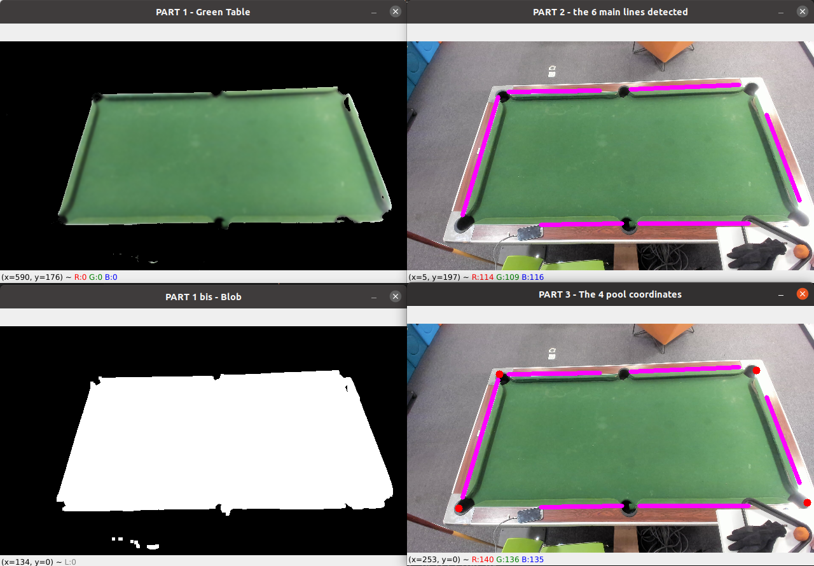

# Pool-table-detection
Find coordinates of a colored pool table in 3 steps:

- **STEP 1** : Detect the pool table as a blob 
(inspired by https://stackoverflow.com/questions/41138000/fit-quadrilateral-tetragon-to-a-blob)
- **STEP 2** : Detection of the 6 main lines surrounding the blob (using cv2.ximgproc.createFastLineDetector())
- **STEP 3** : get the pool table 4 coordinates that are the lines intersection points

Here is a mosaic picture of the 3 steps :

## How to change the targeted color?

In this example, we are targeting the green color of the pool, but what about targeting a red rectangle or any other color?

It is very simple : you just have to change the HSV boundary mask called *hsv_lower* and *hsv_higher*.
To know which boundaries values to choose, you can take a look [on this page](https://stackoverflow.com/questions/10948589/choosing-the-correct-upper-and-lower-hsv-boundaries-for-color-detection-withcv)